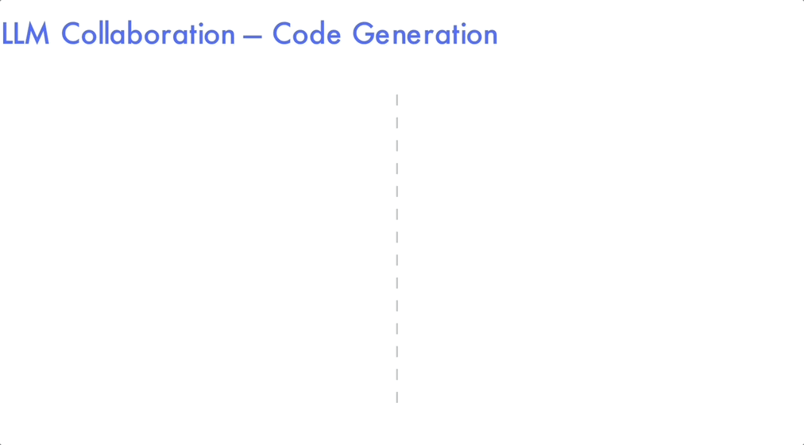

# LLM Collaboration – Code Generation

Training scripts and configs for the code-generation tasks in _"LLM Collaboration with Multi‑Agent Reinforcement Learning"_.



## Benchmarks

- MBPP: 427 problems on split `sanitized`
- HumanEval: 164 problems on split `test`
- CoopHumanEval: 82 problems on split `test`

## Training Scripts

```bash
python LLM_Collab_Code_Generation/train_grpo.py \
  --config LLM_Collab_Code_Generation/configs/grpo_he_config.yaml

python LLM_Collab_Code_Generation/train_magrpo.py \
  --config LLM_Collab_Code_Generation/configs/magrpo_che_config.yaml
```

Override any configuration value inline with `--override`:

```bash
python LLM_Collab_Code_Generation/train_magrpo.py \
  --config LLM_Collab_Code_Generation/configs/magrpo_he_config.yaml \
  --override model.name='bigcode/starcoder2-3b' magrpo.num_turns=1
```

## Settings

### Joint Action Modes

`magrpo.joint_mode` controls how each agent’s `magrpo.num_generations = G` samples combine into joint actions. `align` (default) pairs the $g$‑th sample from every agent, yielding $G$ siblings per node. `cross` forms the Cartesian product, yielding $G^N$ siblings for $N$ agents. After $T$ turns (no early termination), aligned trees expand to $G^T$ leaves, while crossed trees expand to $G^{N \cdot T}$. Align is faster in wall-clock time; cross reuses the same samples but provides denser credit assignment.

### Advantage & Baselines

Advantages use the mean return of the sibling set at each node as the baseline, matching the Dr. GRPO update. No standard-deviation normalization, importance sampling ratios, or epsilon clipping are applied because training is strictly on-policy.

### Sampling

`magrpo.num_turns` controls tree depth and `magrpo.num_generations` controls branching factor. Under `align`, each node has $G$ siblings and the trainer evaluates $G^T$ joint actions at depth $T$; under `cross`, each node has $G^N$ siblings and depth-$T$ leaves scale to $G^{N \cdot T}$. The same sibling baseline referenced above is reused for every node.

### Termination Threshold

`magrpo.termination_threshold` compares the mean immediate reward of the current sibling set against the threshold. When the threshold is exceeded, the branch stops expanding at that turn and the trainer backpropagates from the truncated subtree while other branches continue exploring.

### History

Each agent receives its own full history at every turn: all of its past prompts and responses plus the new external prompt/context. No cross-agent transcripts are injected; coordination happens only through the shared reward.

### External Feedback

`external.mode` shapes the prompt that seeds each turn:

- `level_feedback` (default) appends syntax/test diagnostics and asks for a code-only revision. `external.sandbox_slice` controls how many eval asserts to surface (1 by default, 0/None/`'all'` to show every test, negatives to index from the end).
- `expert_edits` calls an external LLM (configured via `external.expert_edits_model`, default DeepSeek-Coder) to produce compact edit suggestions before asking for a revision.
- `plain` simply restates the prior attempt and asks for a concise "revise, code-only" answer.

## Reward Structure

`rewards/code_rewards.py` implements the aux/main collaboration reward in three levels:

1. **Function definitions**: +0.4 when the auxiliary function is well defined with a return value, +0.6 when the entry-point function is defined correctly. Missing the main definition halts scoring.
2. **Syntax**: Both functions are concatenated with any imports extracted from the prompt; a clean syntax check yields +0.5 and allows execution.
3. **Execution**: Prompt-derived tests (10 s timeout per assert, up to three timeouts) run inside a sandbox. Passing assertions earn up to +1.0, with +0.5 bonus when the main function uses the aux function, +1.0 when the main is not a thin wrapper, and −0.5 if the aux return value is ignored. These same rewards back evaluation during logging.

## Logging

`loggers/` adapt the shared `MAGRPOTrainer` utilities to emit pass rates, syntax success, reward decomposition, termination statistics, and aux-usage diagnostics. Configure Weights & Biases by setting `wandb.project`, `wandb.entity`, and `wandb.name` in YAML or through overrides. `output.save_model` stays `false` by default to avoid storing large checkpoints, while `output.verbose` toggles the detailed per-episode traces used when debugging on a cluster.
